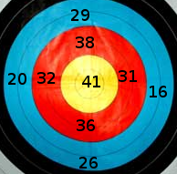

## 几点说明
- 这是生命之光教会儿童主日学的几位同工为我们教会的孩子们准备的一些数学练习题。第一套题和答案完全公开。前面五题是用中英文双语给出题目（为测试我们是否可以使用中文），后面五题只用英语给出题目。
- 生命之光教会 聚会时间 每礼拜日上午 10:00-12:00， 地点：50 Witako Street, Lower Hutt. 联系人：张力夫牧师（电话: 04-9349777, 手机: 021-851222). 
- 这些练习题主要来自惠灵顿地区中学数学竞赛，没有标准答案。所有的解答都是根据我们的理解给出。这是我们第一次试验，因此肯定会有很多不足甚至错误。 欢迎大家指正赐教。Please help improve these slides by sending us your comments and suggestions.


---  &radio

The average speed of a cyclist in the Tour de France is 45 kilometers per hour. This speed, in meters per second, is close to (在环法自行车赛中的一位自行车选手的平均速度是45公里/小时，这个速度如果转换成以 米/秒 为单位，则它的数值最接近下面哪个数) </p>

1. 7.5
2. _12.5_
3. 75
4. 125
5. 750

*** .hint
1 kilometer = 1000 metres, 1 hour = 3600 seconds, 

*** .explanation
speed = 45 kilometers per hour = $45\times \frac{ 1000 \ {\mathrm {metres}}}{3600 \ {\mathrm {seconds}}}$ 

```r
45000/3600.0
```

```
[1] 12.5
```

---  &radio

Cubes are glued together face to face as shown in the diagram. What is the surface area, in square centimetres, of the solid if its volume is 448 cubic centimetres? (大小相等的正方体按照如图所示的方式用胶水粘在一起，这样得到的立体的体积是448立方厘米，那么这个立体的表面积是多少平方厘米？)</p>

<div style='text-align: center;'>
    
</div>

1. 384
2. 448
3. _480_
4. 560
5. 576

*** .hint
7 identical cubes add up to 448 cubic centimetres. From this we can find the side length of each cube.

*** .explanation
Let $x$ be the side length of each cube, then $7x^3=448=7\times 64$, so $x=4$ centimetres.
The surface area is $6\times 5\times 4^2= 480$ square centimetres.

--- &radio

I have just got a new pin number for my eft pos card and have worked out that it will be easy to remember, as it is of the form $abba$ where $a\ne b$ and both $ab $ and $ba$ are primes ($a$ and $b$ are digits). How many numbers are there of this form? (我的银行现金卡有一个新密码，我发现它很容易记住，因为这个密码是 $abba$ 的形式，其中 $a\ne b$，并且 $ab$ 和 $ba$ 都是素数。请问总共有多少个数具有这种形式？)

1. 8
2. 9
3. _10_
4. 11
5. 12


*** .hint
List all primes less than 100 to identify the possible numbers.

*** .explanation
We can list all primes less than 100 to find all possible numbers. Both $ab$ and $ba$ are primes, so these numbers of form $ab$ could not end with 2, 4, 5, 6, 8, which means we need only consider the numbers ending with 1, 3, 7 or 9. So we need consider only numbers starting with 1, 3, 7 or 9. So the numbers of form $ab$ are

13, 17, 19 

31, 37

71, 73, 79

91, 97.


13 and 31 can form two such pin numbers 1331 and 3113. Similar considerations for the other numbers, so the total number of this form is 10.

--- &radio
$n!$ is defined by $n!=n\times (n-1)\times (n-2)\times \cdots\cdots \times 3\times 2\times 1.$ &nbsp;  For example,  $6!=6\times 5\times 4\times 3\times 2\times 1=720. $  

The last non-zero digit of &nbsp; $20!$  &nbsp; is （ $20!$  &nbsp; 的非零数字中的最后一位是）

1. 2
2. 4
3. 5
4. 6
5. _8_

*** .hint
Get your hand dirty!

*** .explanation
Let D(n) be the last non-zero digit, then we can list 

6!=720, &nbsp; D(6)=2. &nbsp; 7!=5040, &nbsp; D(7)=4.

8!=40320, &nbsp; D(8)=2. &nbsp; 9!=362880, &nbsp; D(9)=8.

10!=3628800, &nbsp; D(10)=8. &nbsp; 11!=39916800 , &nbsp; D(11)=8.

12!=..., &nbsp; D(12)=6. &nbsp; 13!=...,  &nbsp; D(13)=8.

14!=...,  &nbsp; D(14)=2. &nbsp; 15!=1307674368000,  &nbsp; D(15)=8.

16!=...,  &nbsp; D(16)=8. &nbsp; 17!=...,  &nbsp; D(17)=6.

18!=...,  &nbsp; D(18)=8. &nbsp; 19!=...,  &nbsp; D(19)=4.

20!=...,  &nbsp; D(20)=8. &nbsp; So the sanswer is 8.

Comment: There is more elegant way to find D(20), but it is beyond Year 9 maths.


--- &radio
Counters are placed on this $4\times 4$ grid of squares. No more than one counter may be placed on any square and no more than three on any row, column or diagonal. What is the maximum number of counters that can be placed on this grid following the rules? (用于计数的东西，比如小石子，放在四行四列的方格子里。每个小格子最多可放一颗小石子，每一行每一列和每一个斜对角上最多可放三颗小石子。按照这样的规则，这个图中最多可放多少颗小石子？)

<div style='text-align: center;'>
    
</div>

1. 9
2. 10
3. 11
4. _12_
5. 13

*** .hint
Estimate the upper bound first. 

*** .explanation 
Each row allows 3 counters at most, so the maximum number of total counters allowed is $3\times 4=12$. One of the possible placements is shown in the diagram. The diagram shown contains 12 counters. So the answer is 12.
<div style='text-align: center;'>
    
</div>

--- &radio

A bicycle chain travels over a front sprocket with 48 teeth and passes to the sprocket on the rear wheel axle which has 18 teeth. For each complete revolution of the back sprocket, what is the angle through which the pedals turn?

1. $960^{\circ}$
2. $360^{\circ}$
3. _$135^{\circ}$_
4. $120^{\circ}$
5. $67.5^{\circ}$

*** .hint
It is easy!

*** .explanation

```r
18.0/48*360
```

```
[1] 135
```


--- &radio
A circle has a perimeter of 5 cm. Its area, in square centimetres, is

1. _$\frac{25}{4\pi}$_
2. $\frac{25}{4}$
3. $\frac{2\pi}{50}$
4. $50\pi$
5. $25\pi$

*** .hint
Perimeter= $2\pi r$,  &nbsp; $area = \pi r^2.$

*** .explanation
$L=2\pi r$, so $r=\frac{5}{2\pi}$ and $S=\pi r^2=\frac{25}{4 \pi}.$


--- &radio

My recipe for chocolate chip cookies states that the ingredients needed to make 35 biscuits include one and a half cups of chocolate chips. I want to make 210 chocolate chip cookies for my party. One packet of chocolate chips contain 2 cups of chocolate chips. How many packets of chocolate chips do I need?

1. 2
2. 3
3. 4
4. _5_
5. 6

*** .hint
1.5 cups of chocolate chips makes 35 biscuits, so 3 cups of chocolate chips makes 70 biscuits. This means 1.5 packets of chocolate chips makes 70 biscuits.

*** .explanation 
1.5 cups of chocolate chips makes 35 biscuits, so 3 cups of chocolate chips makes 70 biscuits. This means 1.5 packets of chocolate chips makes 70 biscuits and it takes 4.5 packets of chocolate chips to make 210 biscuits. So the answer is 5.


--- &radio

How many times can you score a total of 100 by throwing 4 darts that all land on the dart board?
<div style='text-align: center;'>
    
</div>
1. 2
2. 3
3. 4
4. 5
5. _6_

*** .hint
Get your hand dirty!

*** .explanation

16+16+32+36=100, &nbsp; 16+20+32+32=100, &nbsp; 16+20+26+38=100

16+26+26+32=100, &nbsp; 16+26+29+29=100, &nbsp; 20+20+29+31=100


--- &radio

An electronic device has one bulb that flashes "on and off" each 60 seconds and another that flashes "on and off" each 62 seconds. They both flash "on and off" at 8:00 am. The time when they will next flash "on and off" together is

1. 8:30 am
2. _8:31 am_
3. 8:59 am
4. 9:00 am
5. 9:02 am

*** .hint
Find the least common multiple of 60 and 62.

*** .explanation

The least common multiple of 60 and 62 is $2\times30\times31=60\times 31$.  So the time they will next flash "on and off" together is 8:31 am.</p>
